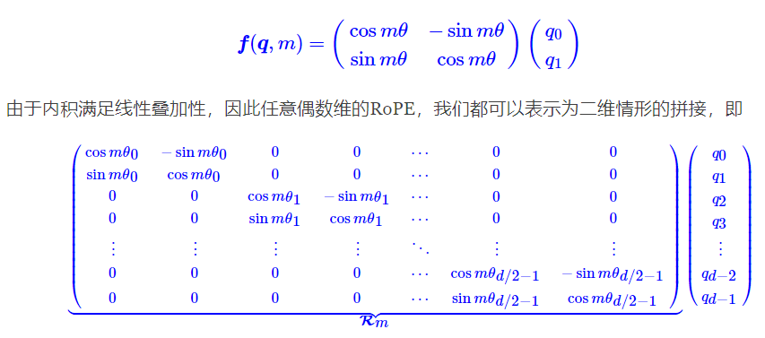
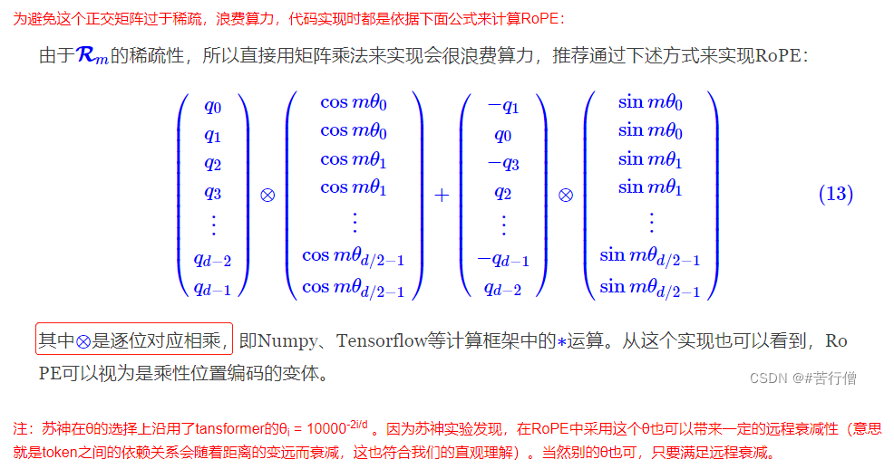

# Positional-Encoding

**Sinusoidal Positional Encoding**： 

[reference1](https://zhuanlan.zhihu.com/p/454482273)

[reference2](https://spaces.ac.cn/archives/8231)

**Rotary Position Embedding**

[reference1](https://spaces.ac.cn/archives/8265)

[reference2](https://blog.csdn.net/weixin_43646592/article/details/130924280)

